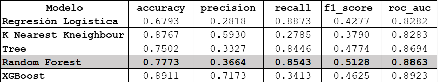
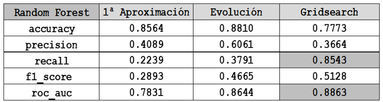

# **Modelo Previsión Ventas Productos Financieros**

### **1. Motivación Personal**

Desde 1998 hasta la actualidad, he desarrollado mi vida profesional en una entidad financiera, principalmente en Banca de particulares. Durante estos 23 años he pasado por todas las categorías laborales posibles dentro de una oficina comercial abierta al consumidor.  Desde comercial de caja y de mesa,  a subdirector y director de oficina. En 2018, motivado por la búsqueda de nuevas habilidades, reciclaje laboral y personal, la adaptación a la nueva realidad de transformación digital y la necesidad de construir un plan alternativo debido a las inciertas perspectivas laborales,  huyendo de mi zona de confort decido cursar un Master en Bussines Analytics con la intención de aprender nuevas formas de análisis de negocio y poder ponerlas en práctica.   Durante el curso me doy cuenta que aun sin ninguna base de programación o informática, estadística o matemáticas, procediendo de una licenciatura de letras, había encontrado una motivación, una nueva parcela de estudio y un nuevo reto.  Decido continuar la formación con el **Master en Data Science de K-School**, recomendado por un antiguo profesor y siempre avisado de la dificultad técnica del mismo.  El resultado lo puedo definir en una frase.  **Intenso pero muy satisfecho y con ganas de continuar mi formación.**

### **2. Datos**

Los datos provienen de la suma de diferentes conjuntos de datos obtenidos directamente de la entidad financiera. TODOS LOS DATOS HAN SIDO ANONIMIZADOS. SE HAN ELIMINADO LOS NOMBRES Y EL NÚMERO DE CLIENTES INTERNOS, SE HAN ELIMINADO EL NÚMERO Y LAS ESPECIFICACIONES DE LAS DIRECCIONES DE ÁREA Y DE OFICINA Y, POR ÚLTIMO, SE HAN ELIMINADO LOS NOMBRES DE LOS ASESORES COMERCIALES. A todos estos datos se les ha asignado un número de identificación ficticio, quedando únicamente los datos de tenencia o no de producto por parte de los clientes.

### **3. Objetivos**

Los Seguros de Riesgo comercializados en las oficinas bancarias, así como su mantenimiento en cartera durante 5 años de media, son de gran importancia dentro de la cuenta de resultados de una oficina y por extensión de un banco. En este escenario y a través de un conjunto de datos pertenecientes a 450.000 clientes he querido desarrollar un modelo predictivo de compra de estos productos financieros concretando en los Seguros del Hogar.

### **4. Finalidad**

Generar un modelo predictivo de clasificación que ayude a toda la fuerza comercial de las sucursales a orientar la comercialización, a optimizar los tiempos, metodologías y sistemas utilizados. Todo ello en busca de un mayor éxito de ventas y satisfacción de los clientes

### **5. Importancia del problema a resolver**

La generación de comisiones es fundamental para la cuenta de resultados de la oficina y del banco.  Los seguros de hogar se quedan en cartera durante un periodo medio de 5 años. Cada seguro de hogar contratado deja una comisión directa del 15 %.  Esto sobre un seguro de hogar de prima media de 300€ supone 45€ de comisión anual.   Nuestra base de datos correspondiente únicamente a 162 oficinas y 450.000 clientes podría llegar a generar unas comisiones anuales de más de 17mm€ en caso de que todos los clientes que no disponen de seguro de hogar lo contratasen.  Solo con esta cifra y extrapolándola a un colectivo de clientes totales de 3 – 4 millones de clientes,  queda más que explicado la evidente y clara la necesidad de identificar potenciales clientes que sean susceptibles de contratar el seguro de hogar.  

### **6. Informacion del Repositorio**

El repositorio se estructura en   5 carpetas y 4 archivos.
  
  Carpeta 1 – Códigos Python Limpieza y Unión 

  Carpeta 2 – Códigos Python EDA Análisis Exploratorio

  Carpeta 3 – Códigos Python Preprocesado

  Carpeta 4 – Imágenes .png guardadas de cada una de las gráficas construidas
 
  Carpeta 5 – Códigos Python Modelos clasificación utilizados.
  
  Archivo 1 – Diccionario e información del significado de las variables
  
  Archivo 2 – Readme con información del Trabajo y comunicación de expectativas
  
  Archivo 3 – .gitignore. Archivos descartados en las actualizaciones del repositorio.
  
  Archivo 4 – Memoria TFM.doc

### **7. Requisitos Tecnicos**

Para ejecutar el código es necesario tener instalado Python versión 3.8 así como distintos paquetes o librerías.  Se recomienda tener instalada la Suite Anaconda donde se encontrarán preinstalados la mayoría de los paquetes y librerías que son necesarias. Adicionalmente sera necesaria la instalacion de los siguientes librerias:

•	Imbalanced learn - pip install imbalanced learn

•	pydotplus - pip install pydotplus

•	strealit - pip install setreamlit

### **8. Guia y ejecución**

Paso 1. Clonar repositorio GitHub https://github.com/romayana/Financial-Product-Sales-Forecast-Model.git en carpeta local elegida.

Paso 2. Descargar base de datos:
A pesar de haberse Anonimizado toda la base de datos, se ha decidido que la misma no estará disponible en el repositorio de GitHub.  Para acceder a la base de datos ubicada en el Google Drive del propietario del TFM,   se tendrá que solicitar permiso y acceso a la misma  dirigiendo correo electrónico a manuelgonzalezprados@gmail.com el cual previa valoración de los fines y objetivos perseguidos podrá compartir el enlace con la persona solicitante.

Paso 3. Una vez compartido el acceso,  descargar y ubicar la carpeta entera llamada Origin_Data en la carpeta carpeta local donde se ha clonado el repositorio.

Paso 4. Ejecutar código con la siguiente secuencia y orden. Los archivos csv se irán guardando en cada una de las carpetas.

1º Carpeta Cleanning & Merging
 - _merging_data,ipynb 
 - _cleanning_data.ipynb

2º Carpeta Exploratory Data Analysis
 -	EDA.ipynb

3º Carpeta Preprocessing
 -	Preprocessing.ipynb

4º Carpeta Models
 -	Ejecutar los modelos.

### **9. Eleccion del Modelo**

Queremos saber si un clientes es susceptible de contratar o no un  seguro de hogar. Buscamos una sistemática comercial que simplifique el estudio de los clientes antes de llamarles.  Buscamos una optimización del tiempo para llegar a cuantos mas clientes mejor. Nos interesa finalmente filtrar aquellos clientes a los que tenemos que llamar.  Este filtro se puede obtener desde dos perspectivas.  Y lo buscamos dentro de una matriz de confusión. Buscando verdaderos positivos para cargarlos en el objetivo de contactos diarios y que los comerciales puedan llamarles o identificando verdaderos negativos para desecharlos y finalmente coger los verdaderos positivos y llamarles.  En ambos casos llegamos a la misma conclusión y obtenemos lo que realmente queremos.  Llamar a los que nos interesan.

Se han desarrollado 5 modelos distintos de clasificación con el fin de buscar aquel que mejor métricas y mejores comportamientos tenga según nuestras necesidades concretas. Las principales métricas que utilizaremos como evaluadores de nuestros modelos son Recall y Roc Auc.

Modelos Machine Learning Entrenados.

•	Modelo Clasificación Regresión Logística 

•	Modelo Clasificación K-Nearest Neighbor 

•	Modelo Clasificación TREE

•	Modelo Clasificación Xgboost

•	**Modelo Clasificación Random Forest - MODELO FINAL ELEGIDO**

**Resumen de Resultados Obtenidos de los modelos entrenados**

### **10. Desarrollo del Modelo**

•	Primera Aproximación

Mi primera intencion era saber que resultados obtendriamos sin hacer nada, simplementes utilizando la base de datos en crudo.  Utilizamos en esta primera aproximacion al modelo la primer base de datos construida en nuestra fase de merging & cleanning.  Se trata de una base de datos cuyo unico preprocesamiento ha sido la identificacion de los Nans y posterior asignacion de valores acordes a las particularidades de cada una de las variables.

Los resultados obtenidos fueron las siguientes.  Claramente mejorables. 

•	Construcion y evolucion del modelo.  

Comenzamos el estudio real del modelo.  Recordamos que durante la fase del preprocesado, se generaron hasta 3 bases de datos distintas.

1.	Base de datos eliminando variables categóricas, cambiando a booleano variables de FFII y PP,   eliminando clientes de ciertos rangos de edad y adaptando las variables categóricas con Label Encoder. 

2.	Base de datos anterior a la que se le une la normalización a través de minmaxscaler para que todas las variables estuviesen en una misma escala.  

3.	Base de datos anterior implementando PCA reducción de dimensionalidad.

El modelo ha sido entrenado con las dos primeras bases de datos.  La tercera base de datos con PCA implementada no la vimos necesaria ya que despues de estudiarse la posible reduccion de dimensionalidad vimos que lo único que hacíamos era reducir dos variables con respecto a la base de datos principal.

El entrenamiento y resultado de las dos primeras bases de datos ha sido casi idéntico. Observamos que el hecho de haber normalizado los datos no ha sido un mejor condicionante para obtener mejores resultados.  La explicación de esto es que en un modelo de RandomForest, la normalización no es necesaria ya que no se comparan magnitudes. Se trata de dividir rangos y no de compararlos.  Por otro lado,  durante el preprocesado hemos visto como la importancia de las variables no difería mucho. Estos motivos han hecho que en el estudio final no se haya utilizado la base de datos normalizada.

•	Primeros Problemas detectados

-  Desbalanceo del Taget. 87%-13%.   La primera decisión que tomamos en esta primera evolución del modelo es utilizar un estimador que intente poner remedio al gran desbalanceo de nuestro target.  Para ello utilizamos el estimador de “ Class Weigth = Balanced” para intentar corregirlo. 

-  Overfitting.  Durante el entrenamiento se evidencia claramente la existencia de overfitting.  Los resultados recall obtenidos de Train (0.99) y Test (0.37) demuestran que hay una grave situacion de sobreajuste confirmada posteiormente mediante tecnicas de CrossValidation.  Lo demostramos visualmente mediante grafica de ajuste donde se observa como a partir de 8 "profundidades" empieza a no generalizar bien, separandose las curvas de Train y Test.  

Los resultados y metricas finales de esta primera evolucion solo mejoran algo nuestra primera aproximación. Necesitamos implementar mejoras que nos lleven a conseguir nuestro objetivo.

  
